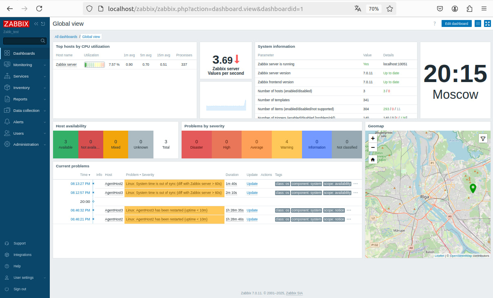

# Домашнее задание к занятию "`Система мониторинга Zabbix`" - `Хомяков Антон`

### Задание 1

Установка Zabbix Server, Frontend, Agent2 и PostgreSQL 15:

```
wget https://repo.zabbix.com/zabbix/7.2/release/debian/pool/main/z/zabbix-release/zabbix-release_latest_7.2+debian12_all.deb
sudo dpkg -i zabbix-release_latest_7.2+debian12_all.deb
sudo apt update

sudo apt install zabbix-server-pgsql zabbix-frontend-php php8.2-pgsql zabbix-apache-conf zabbix-sql-scripts zabbix-agent2

sudo apt install postgresql

sudo systemctl is-active postgresql

sudo -u postgres createuser --pwprompt zabbix
sudo -u postgres createdb -O zabbix zabbix

zcat /usr/share/zabbix/sql-scripts/postgresql/server.sql.gz | sudo -u zabbix psql zabbix

sudo sed 's/old_string/new_string/g' file_name

sudo sed -i '/# DBPassword=/a DBPassword=zbxdb' /etc/zabbix/zabbix_server.conf

sudo systemctl restart zabbix-server zabbix-agent2 apache2
sudo systemctl enable zabbix-server zabbix-agent2 apache2
```

## Экран настройки конфигурации в Web UI Zabbix:


## Добавления хоста в Zabbix


---

### Задание 2

# Zabbix Agent Setup – Homework

## Configuration Global view Dashboard


## Monitoring > AgentHost2 Latest data


## AgentHost3 > Problems


## Zabbix AgentHost3 Log


## Configuration > AgentHost2 Dashboards


## Configuration > AgentHost3 Dashboards


### Последние данные AgentHost3


### Просмотр лога агента


Список команд для установки и конфигурирования Zabbix Agent:
```
wget https://repo.zabbix.com/zabbix/7.2/release/debian/pool/main/z/zabbix-release/zabbix-release_latest_7.2+debian12_all.deb
sudo dpkg -i zabbix-release_latest_7.2+debian12_all.deb
sudo apt update

sudo apt install zabbix-agent

sudo sed -i 's/Server=127.0.0.1/Server=192.168.56.112/g' /etc/zabbix/zabbix_agentd.conf
sudo sed -i 's/ServerActive=127.0.0.1/ServerActive=192.168.56.113/g' /etc/zabbix/zabbix_agentd.conf
sudo sed -i 's/Hostname=Zabbix server/Hostname=zbx-host01/g' /etc/zabbix/zabbix_agentd.conf

sudo systemctl restart zabbix-agent
sudo systemctl enable zabbix-agent
```
